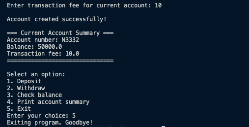

# Bank Account Program

A simple **object-oriented bank account simulator** in Python, demonstrating **OOP concepts** like **inheritance, polymorphism, abstraction, and encapsulation**. The program allows users to create **Savings** or **Current accounts**, perform transactions, and view account summaries.

---

## Features

- **Account Types**:
  - **Savings Account**: Supports deposits, withdrawals, and interest calculation.
  - **Current Account**: Supports deposits, withdrawals with a transaction fee.
  
- **Core Functionality**:
  - Deposit money
  - Withdraw money (with rules: overdraft prevention, transaction fees)
  - Check balance
  - Print account summary
  - Calculate interest (for savings accounts)
  
- **Robust Input Handling**: Prevents invalid inputs using safe float conversion.

- **OOP Principles Demonstrated**:
  - **Abstraction**: `Account` abstract class defines the interface for all account types.
  - **Encapsulation**: Balance and other sensitive data are only modified through controlled methods.
  - **Polymorphism**: Methods like `withdrawMoney()` and `printSummary()` behave differently depending on account type.

---

## Installation

1. Clone the repository:

```bash
git clone https://github.com/buildinrythm/python-bank-account
